# Reader “Hoc Reader”

Reader with translator, basic words training part and “memorizing” notifications. This application was developed in order to improve my English vocabulary through reading books and adding unknown words to my favorite Online Dictionary <a href="https://lingualeo.com">Lingualeo</a>.
Furthermore, I’ve been diving into Android development... 

  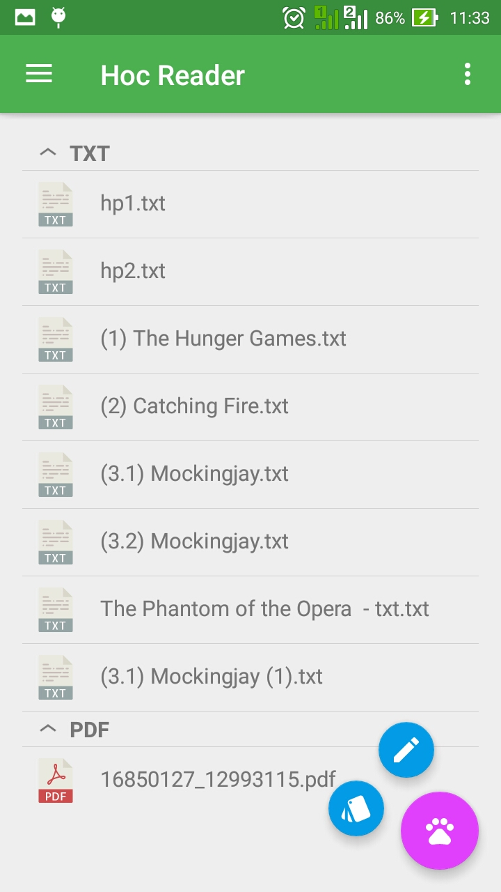
  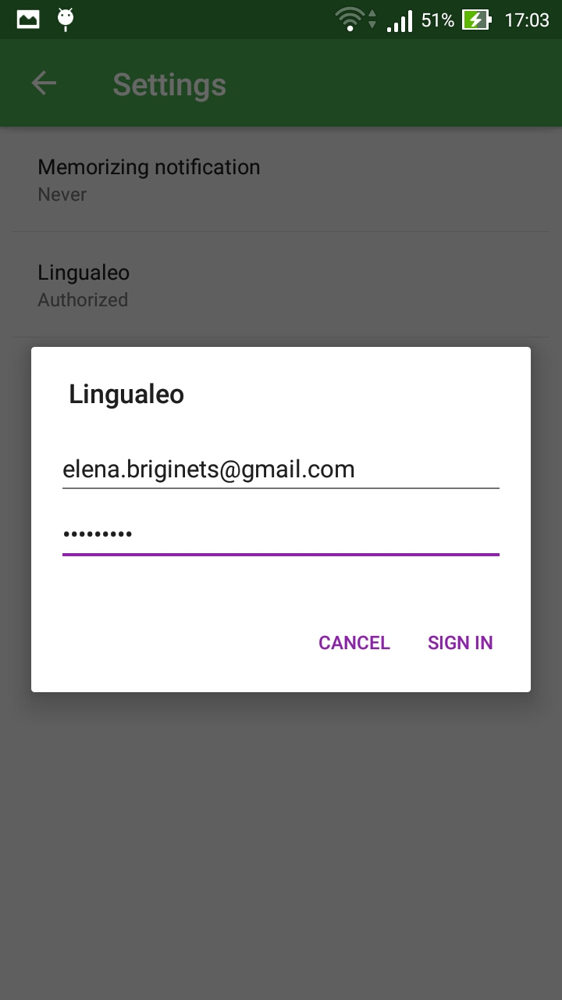
  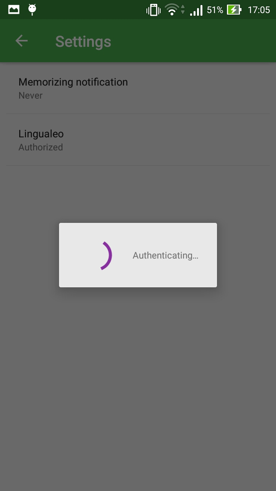

Features:
-	words with images and sounds from Lingualeo API, ability to add words to Lingualeo dictionary (online mode)
-	offline dictionary (consists of added words),  words from device database (just words with translations or descriptions)
-	pages navigation, highlight, bookmarks, font sizes, translators navigation
-	word cards training
- words editor
-	words notifications
- settings

Reader Mode:

  
  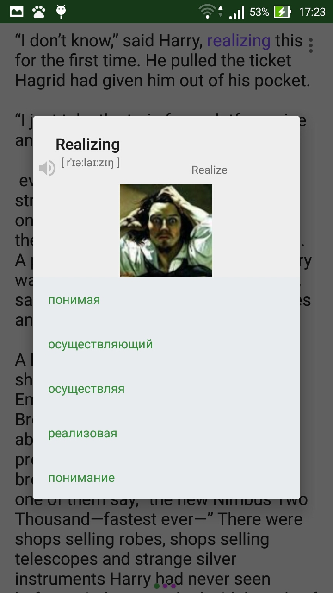
  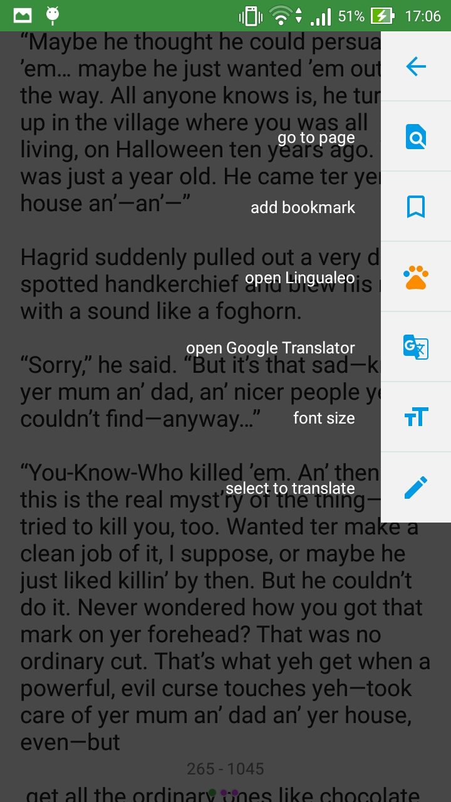
  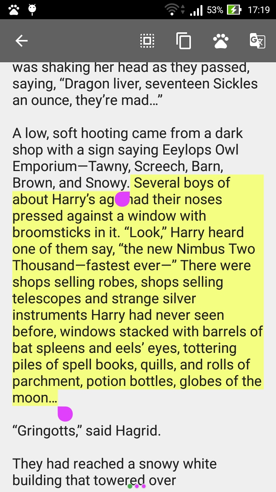

A little part of training new words with "carousel list" online, as well as offline:

  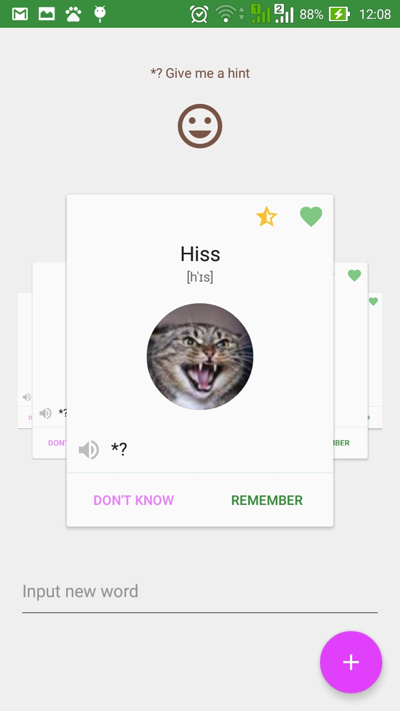
  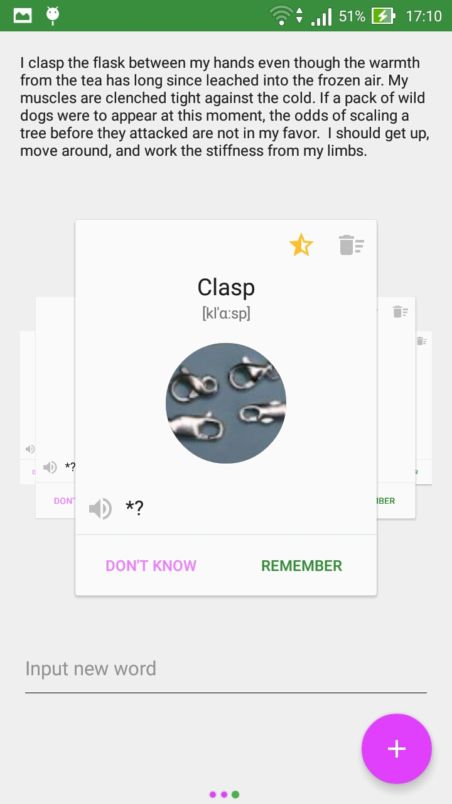

Each word in application with image and sound – those important things make memorizing more efficient.

Word Editor and training part:

  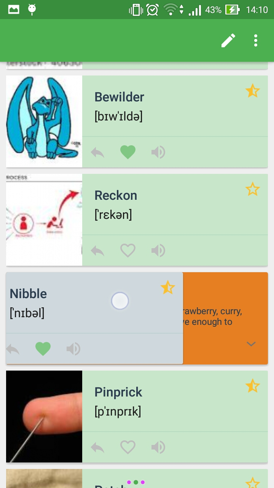
  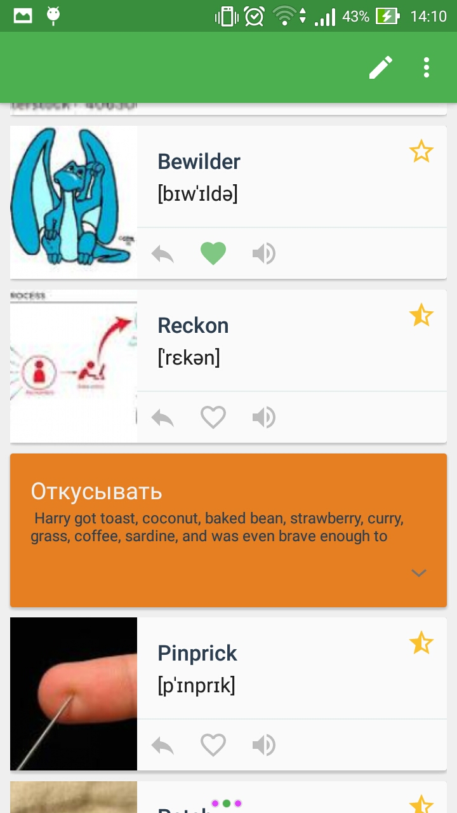
   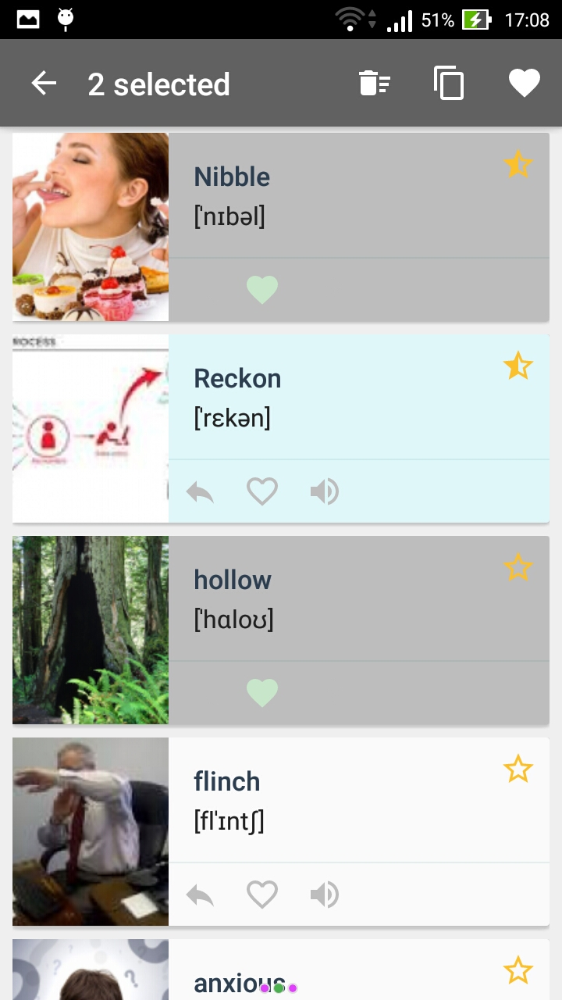

“Memorizing” notifications just remind words:

  
  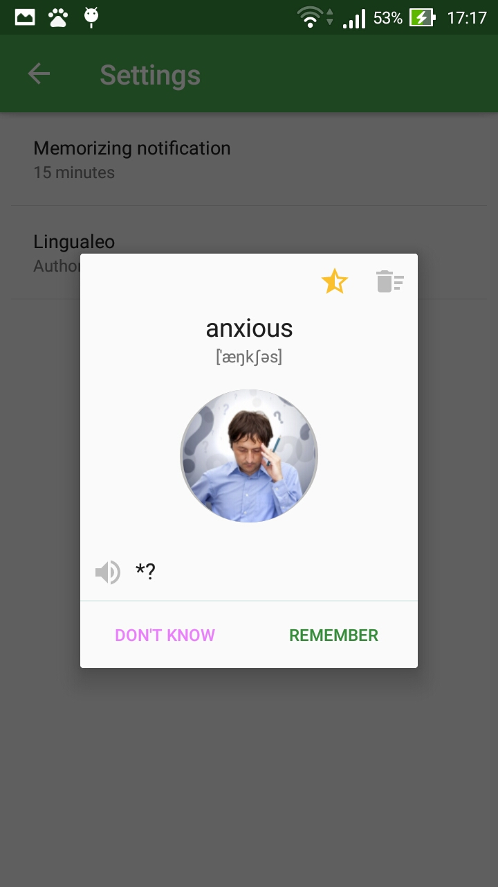

TODO: 
- refactor training: create “memorizing calculation” to see the progress of memorizing words;
- Livio English Dictionary word meanings (offline mode); 
- reading FB2, PDF formats;
- refactor MENU actions: in Book, WordEditor fragments;
- add new words in Training activity;
- edit word in translation dialog, (f.i., to create phrasal verbs).
- synchronize words with Lingualeo Dictionary (added in offline mode)
